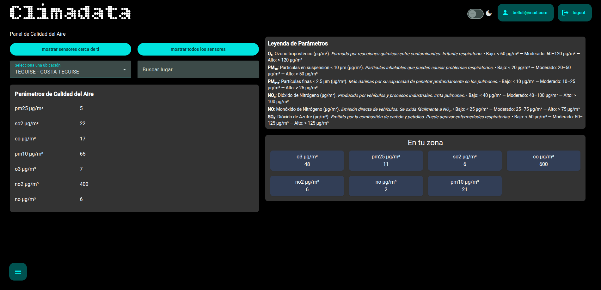
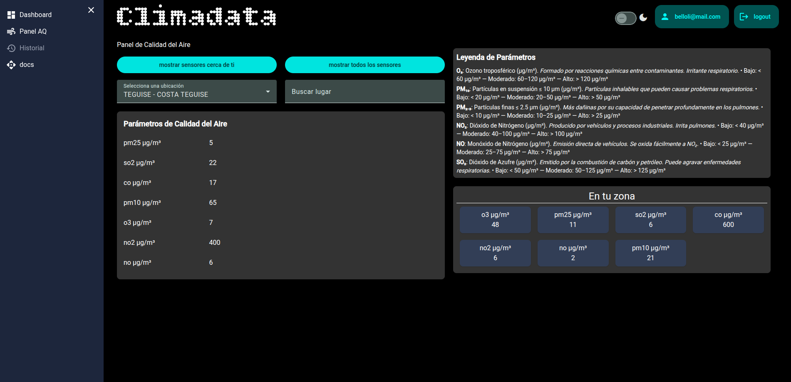
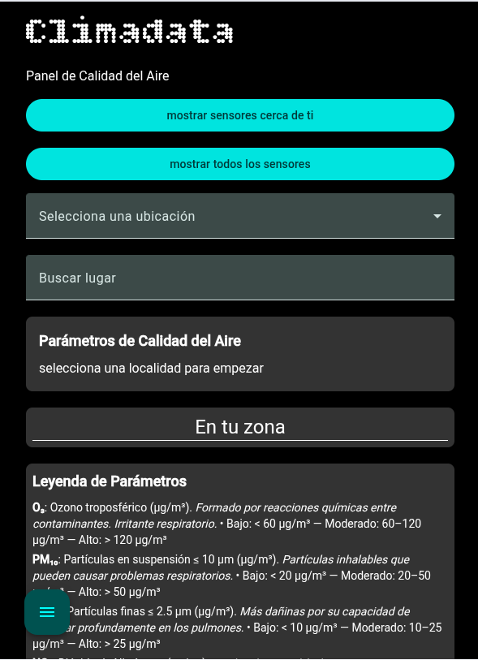
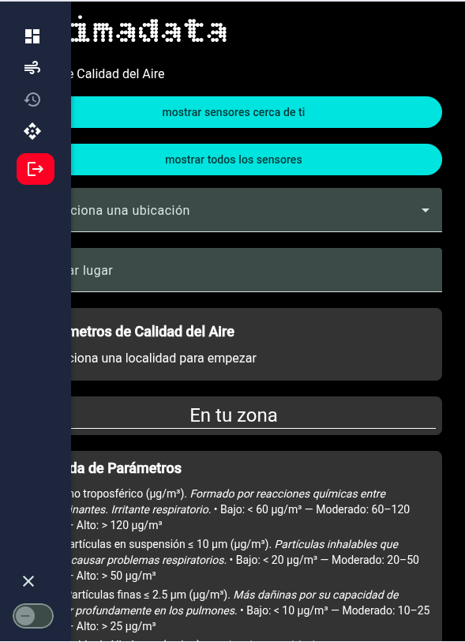
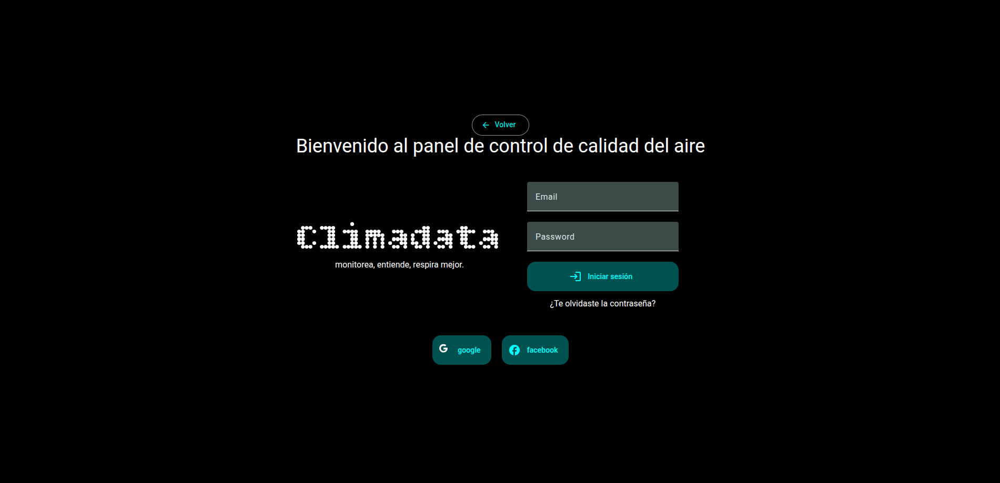
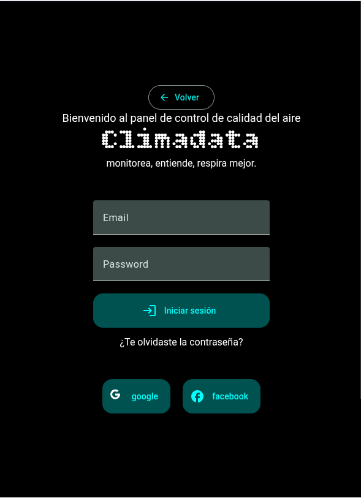

# Proyecto Frontend — Panel de Calidad del Aire

[](https://angular.io/)
[](https://nodejs.org/)

[](LICENSE)
[](#)

---

## Screenshots

| Panel principal Desktop | Panel principal Desktop (aside) |
| --- | --- |
|  |  |

| Panel principal móvil | Panel principal móvil (aside) |
| --- | --- |
|  |  |

| Login desktop | Login móvil |
| --- | --- |
|  |  |


## 📋 Descripción
Aplicación frontend desarrollada en **Angular 20** para la visualización de datos de calidad del aire en tiempo real.  
Incluye gráficos, animaciones y gestión dinámica de sensores y mediciones.

---

## 📦 Requisitos previos
- [Node.js](https://nodejs.org/) >= 24.5.0
- [Angular CLI](https://angular.dev/tools/cli) >= 20.1.2
- npm o yarn como gestor de paquetes

---

## 🚀 Instalación y uso

### 1️⃣ Clonar repositorio
```bash
git clone https://github.com/usuario/proyecto-frontend.git
cd proyecto-frontend
```

### 2️⃣ Instalar dependencias
```bash
npm install
npm update
```

### 3️⃣ Iniciar servidor de desarrollo
```bash
npm run start
```

### 4️⃣ Ejecutar test
```bash
npm test
```

### 5️⃣ Compilar para produccion
```bash
npm run build
# la aplicacion esta compilada en la carpeta /dist
```

---

## 🏗️ Estructura del proyecto
```
src/
 ├── app/                  # Componentes, servicios y lógica principal
 │    ├── components/      # Componentes de UI
 │    ├── services/        # Servicios y lógica
 |    ├── layouts/         # Layouts
 │    └── app.module.ts
 ├── assets/               # Imágenes, fuentes, estilos globales
 ├── environments/         # Configuración de entornos
 ├── index.html
 └── main.ts
```

---

## 🔧 Más dependencias
```json
    "ngx-skeleton-loader": "^11.2.1",   #libreria de esqueleto de carga
    "rxjs": "~7.8.0",                   #para realizar peticiones http
    "tailwindcss": "^4.1.11",           #tailwind
```

---

## 🔗 Backend
https://github.com/Danny-MNXONLINE/backend-climadata


---

## Futuras funcionalidades y novedades
<ul>
 <li>Documentación</li> 
  <li>Añadir más localidades, por ahora limitado a las Islas Canarias</li>
</ul>
